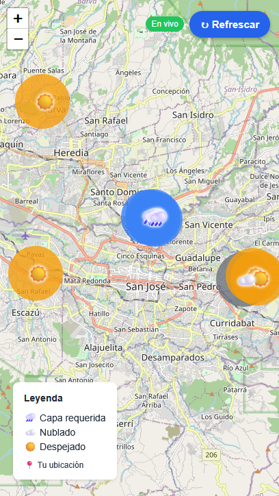
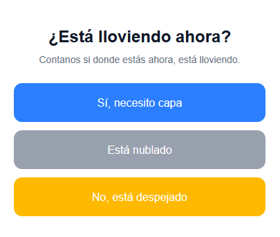

# RainCheck

Crowdsourced weather reporting for motorcyclists. Report your local conditions to unlock the community map.



## How it works

1. **Open the app** → Share your location
2. **Report** → Select if you need a coat (rain/cloudy/clear)
3. **View** → See all community reports on the map
4. **No accounts** → Anonymous, no login required



## Tech Stack

- **Frontend:** Next.js 14, TypeScript, Tailwind CSS
- **Database:** Supabase (Postgres)
- **Map:** Leaflet.js + OpenStreetMap
- **Weather fallback:** Open-Meteo API
- **Hosting:** Vercel

## Local Development

```bash
npm install
npm run dev
```

Open http://localhost:3000

Set env vars in `.env.local`:
```
NEXT_PUBLIC_SUPABASE_URL=your_url
NEXT_PUBLIC_SUPABASE_ANON_KEY=your_key
```

## Deploy

```bash
vercel --prod
```

Add env vars in Vercel dashboard → Settings → Environment Variables.

---

**Made for the San José motorcycle community.** 🏍️
